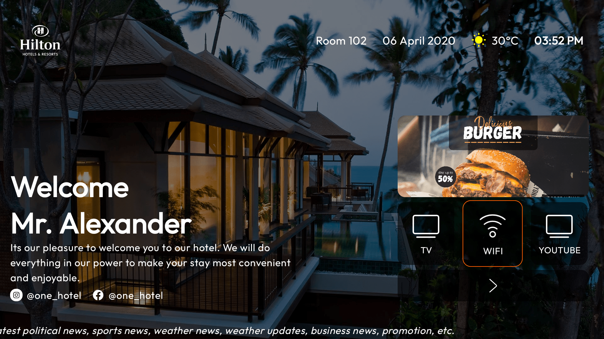
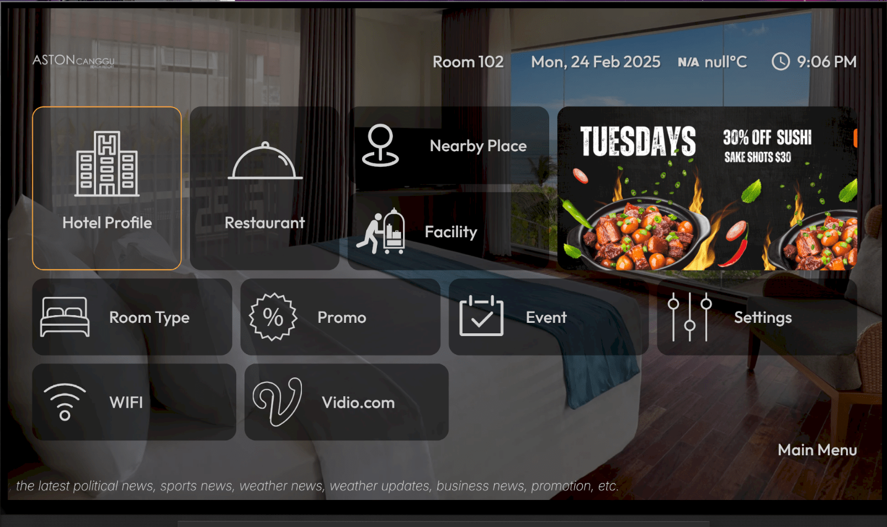
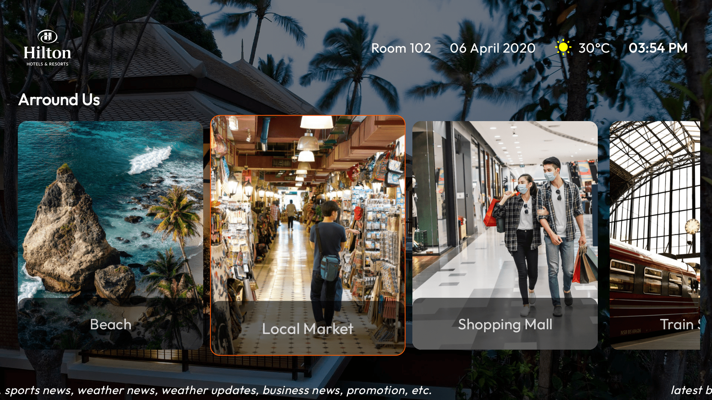
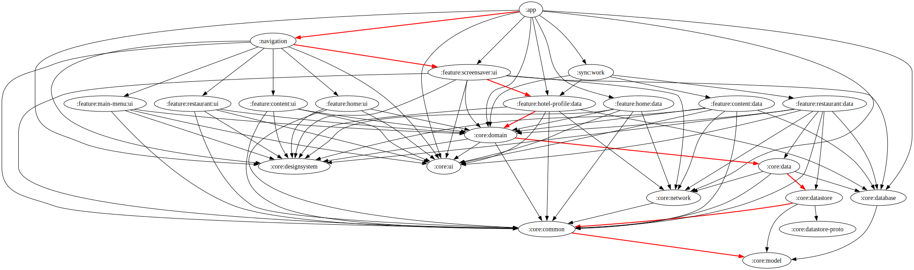

# LauncherCompose

LauncherCompose is an open source launcher for Android TV applications built with Kotlin and Jetpack Compose. It serves as a launcher for hotel applications, providing a user-friendly interface for guests to access various hotel services.

## Dependencies

Backend : [https://github.com/karuhun-developer/hotel](https://github.com/karuhun-developer/hotel)

## Dependencies

The project uses the following major libraries and technologies:

*   [Jetpack Compose](https://developer.android.com/jetpack/compose)
*   [Kotlin](https://kotlinlang.org/)
*   [Coroutines](https://kotlinlang.org/docs/reference/coroutines-overview.html)
*   [Flow](https://kotlin.github.io/kotlinx.coroutines/kotlinx-coroutines-core/kotlinx.coroutines.flow/)
*   [Dagger Hilt](https://dagger.dev/hilt/)
*   [Retrofit](https://square.github.io/retrofit/)
*   [Room](https://developer.android.com/training/data-storage/room)
*   [Coil](https://coil-kt.github.io/coil/)

## Screenshoot

    
    
    
    
    

## Demo

<video
    src='https://github.com/user-attachments/assets/de92c8bd-e7a5-4851-9ba1-48ef249c6732'
    controls
    width="100%"
    alt="Demo video of LauncherCompose">
    Your browser does not support the video element. You can view the demo at our website.
</video>

## Dependency graph

## License

Distributed under the Apache License 2.0. See `LICENSE` for more information.

